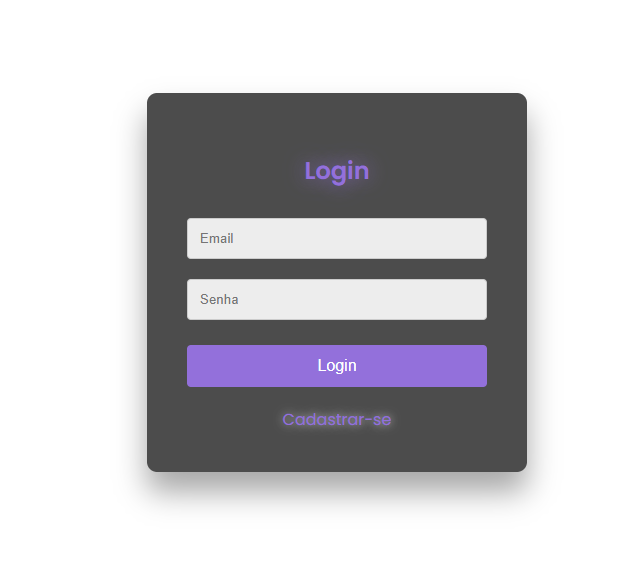

# Cad-log System

O **Cad-log System** é uma aplicação desenvolvida em sala de aula para gerenciar o cadastro de usuários em diferentes perfis: Admin, Gestor e Colaborador. Com foco na segurança e eficiência, a aplicação permite que os usuários façam login, cadastrem novos usuários e gerenciem informações de forma prática e intuitiva.

---

### Funcionalidades ✨

- **Cadastro de Usuários**: Criação de novos usuários com informações como nome, email, senha e perfil. 📝
- **Login de Usuários**: Autenticação segura com validação de credenciais. 🔐
- **Perfis de Usuários**: Três tipos de perfis com diferentes permissões: Admin, Gestor e Colaborador. 👥
- **Interface Intuitiva**: Tela de login e cadastro com design responsivo e acessível. 📱

---

### Estrutura de Arquivos Importantes 📂

#### Descrição dos Arquivos

- **authcontroller.php**: Lógica de autenticação, gerenciando login e logout, validando credenciais e controlando acesso. 🔑
- **usercontroller.php**: Gerencia operações relacionadas aos usuários, como criação, atualização e remoção, interagindo com o modelo User. ⚙️
- **database.php**: Configura a conexão com o banco de dados, contendo credenciais e configurações para o MySQL. 🗄️
- **user.php**: Modelo da entidade User, definindo propriedades e métodos para validação de dados e interações com o banco de dados. 🧑‍💻
- **login.php**: Vista que exibe o formulário de login, permitindo a entrada de credenciais. 📄
- **register.php**: Vista responsável pelo registro de novos usuários, com formulário de cadastro. ✍️
- **index.php**: Ponto de entrada da aplicação, processando requisições e redirecionando usuários. 🚪
- **routes.php**: Define rotas da aplicação, mapeando URLs para controladores e funções específicas. 🗺️
- **database.sql**: Estrutura do banco de dados e instruções para criação de tabelas necessárias. 📊

---

Esse projeto visa facilitar a gestão de usuários de forma organizada e segura, garantindo uma experiência fluida para todos os perfis. 🌟

### Imagens

### 📄 Fontes Consultadas

Para listar as fontes consultadas para as descrições da estrutura do Cad-log System, você pode considerar as seguintes referências:

1. **Documentação do PHP**: [PHP Manual](https://www.php.net/manual/pt_BR/index.php) - Para entender funções e práticas recomendadas no PHP.
2. **Documentação do MySQL**: [MySQL Documentation](https://dev.mysql.com/doc/) - Recursos sobre configuração do banco de dados e comandos SQL.
3. **MDN Web Docs**: [MDN Web Docs](https://developer.mozilla.org/pt-BR/) - Informações sobre desenvolvimento web e criação de interfaces.
4. **Artigos e Tutoriais**: [W3Schools](https://www.w3schools.com/) - Tutoriais sobre PHP, HTML e SQL.
5. **Livros**: "PHP & MySQL: Novice to Ninja" e "Learning PHP, MySQL & JavaScript" - Recursos úteis para o desenvolvimento web.
6. **Comunidades de Desenvolvimento**: [Stack Overflow](https://stackoverflow.com/) - Discussões e soluções sobre problemas específicos relacionados a PHP e MySQL.

---

### ➡️ Como Executar

1. Clone este repositório.
2. Instale as dependências necessárias utilizando o comando `[inserir comando]`.
3. Execute o projeto utilizando o comando `[inserir comando]`.

### ✅ Contribuição

Contribuições são bem-vindas! Se você quiser colaborar com este projeto, siga os passos abaixo:

1. Faça um fork deste repositório.
2. Crie uma branch para a sua feature (`git checkout -b minha-feature`).
3. Faça commit das suas alterações (`git commit -m 'Adicionando nova funcionalidade'`).
4. Faça push para a branch criada (`git push origin minha-feature`).
5. Abra um Pull Request.

### ✒️ Autores

| [ Maria Eduarda Simões Almeida](https://github.com/mariasimoesalmeida) |
|[ Leonardo Rocha](https://github.com/LeonardoRochaMarista) |

